# MetOcean_GUI
> UMaine ASCC Meterological and Oceanic Data Tool

A library for `MATLAB` developed for the ocean team in order to streamline the data extraction process from a variety of sources.
The toolbox also contains a series of processing functions for each dataset.

## Installing / Getting started
The repository can be installed by downloading a `.zip` or via `git` by clicking the <span style="background-color:green">**&#60;&#62; Code&#11206;**</span> button above.

### Installing via direct download
To download a `.zip`, click the `Download ZIP` button and follow the prompts on the screen. 
Extract the `.zip` wherever you would like to locally store the toolbox.

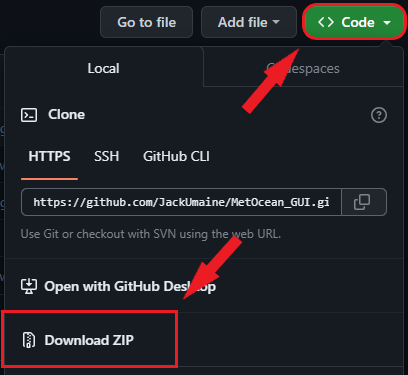

### Installing via git
To download the MetOcean_GUI via git, enter the following commands in a bash window:

```bash
cd /path/to/local/folder
git clone https://github.com/JackUmaine/MetOcean_GUI.git
```

This will create a folder at */path/to/local/folder* with the name MetOcean_GUI.

#### Dependencies
The functions utilize the `natsortfiles.m` function from the MathWorks file exchange.
The function and further information about the function can be found [here](https://www.mathworks.com/matlabcentral/fileexchange/47434-natural-order-filename-sort).


The dependencies for downloading the ERA5 dataset can be found [here](https://confluence.ecmwf.int/display/CKB/How+to+download+ERA5) but are generally as follows:
1. Install the most recent version of `python` compatible with your MATLAB installation. [See here](https://www.mathworks.com/support/requirements/python-compatibility.html)
2. Verify pip has been installed.
3. Register an `api key`/sign-up for the ERA5 dataset.
4. Install the `CDS api` via `pip` with your credentials.

In order to download data from the NREL MHKIT hindcast dataset, the MHKIT toolbox must be installed and added to `MATLAB`.

For information on installing the MHKIT toolbox visit: https://github.com/MHKiT-Software/MHKiT-MATLAB.

## Features
The toolbox downloads data from the following sources:
* ERA5 atmospheric and oceanic data [here](https://cds.climate.copernicus.eu/datasets/reanalysis-era5-single-levels?tab=overview)
* HYCOM ocean surface current data [here](https://www.hycom.org/dataserver/gofs-3pt1/reanalysis)
* NREL wave hindcast data [here](https://www.nrel.gov/water/wave-hindcast-dataset.html)
* NOAA ocean buoy data [here](https://www.ndbc.noaa.gov/)
* OSCAR NASA surface currents [here](https://podaac.jpl.nasa.gov/cloud-datasets?view=list&ids=Projects&values=OSCAR)
* WaveWatchIII 30-year Hindcast Data [here](https://polar.ncep.noaa.gov/waves/hindcasts/nopp-phase2.php)

The toolbox will create a series of locally stored raw data outputs in their various forms (`.nc`, `.csv`, `.mat`) as well as a series of processed `.mat` files once the downloads have finished.

## Deployment
Once the toolbox has been installed via the preferred method and all the dependencies have been handled, use of the code is simple.

Simply navigate to */path/to/local/folder/MetOcean_GUI* in a `MATLAB` window (it is recommended to not have any scripts open in this `MATLAB` window) and either right click `MetOceanGUI.mlapp` and hit run:

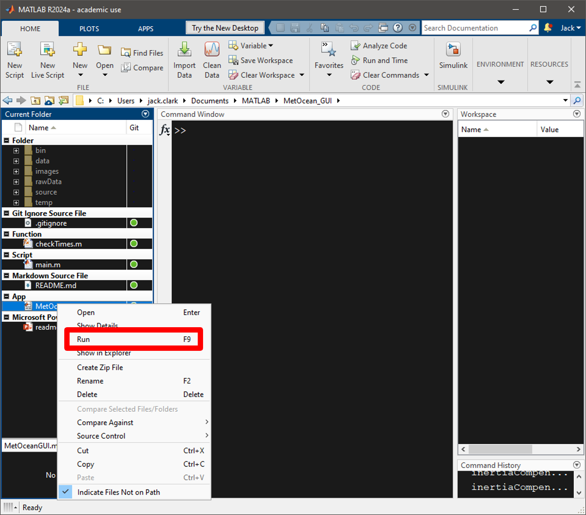

Then follow the on screen prompts:

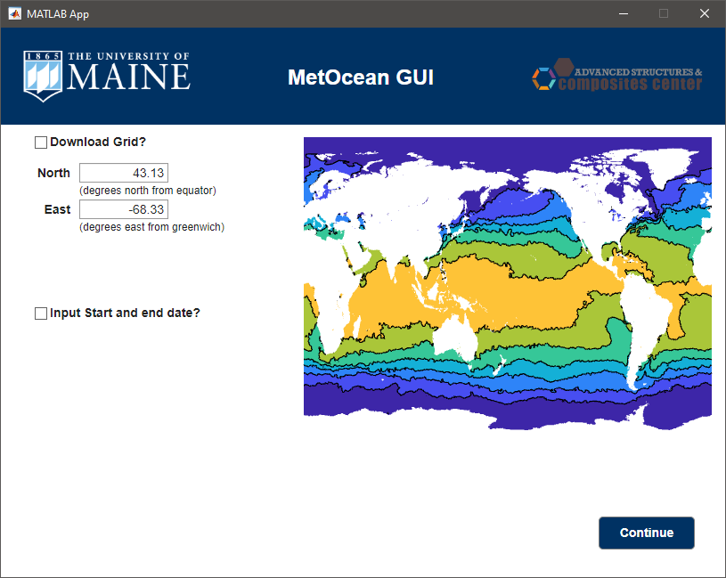

Or enter the following in the command window:

```bash
main
```

The following series of prompts will appear, follow the instructions on screen.

>Selecting data sources:\
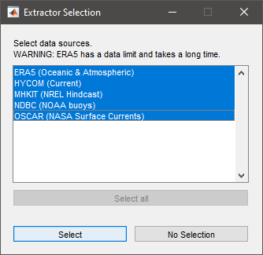

>Inputting location information:\
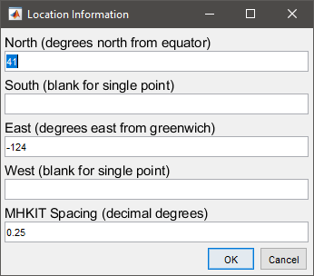

>Inputting time information:\
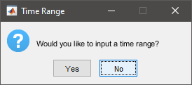\
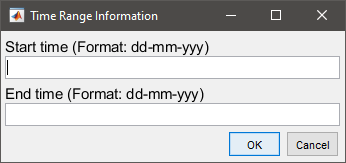

The main command window will the issue a series of pauses or statements for each extractor depending on whether there are further decisions to be made.

HYCOM:
> The HYCOM dataset should download without further input, the new instance of `MATLAB` should provide information on how far along the download is and how long the rest of the data should take to download based on the previous file(s) download speed(s).

ERA5:
> Variable selection is required for the ERA5 download. The following window will prompt the user to select those variables.\
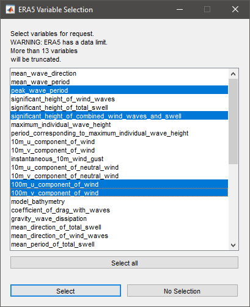

NBDC:
> The NBDC extractor will ask the user which, if any, of the buoys that are close to the are of interest that they wish to use.
the buoys will be color coded and ordered by distance from the location of interest.\
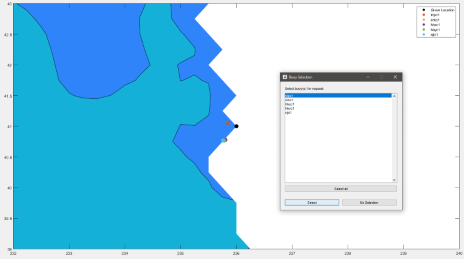

MHKIT:
> The MHKIT extractor asks the user two questions. The first question asks the user which dataset they which to access (1-hourly or 3-hourly). The data available differs between the datasets.\
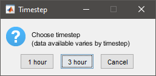 \
Upon selecting which dataset, the user will be presented with variable selection.

| 1-hourly Dataset | 3-hourly Dataset |
|:--:|:--:|
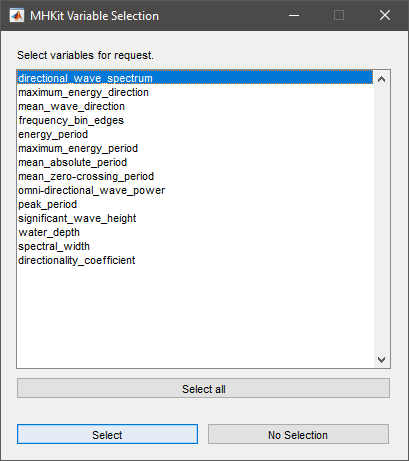 | 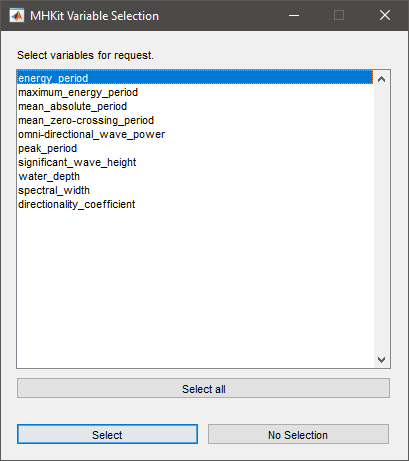

OSCAR:
> The OSCAR extractor will ask which collection the user wishes to download (final, interim, or near-real-time). See the datasets linked above for further information on temporal spacing for the various data collections.\
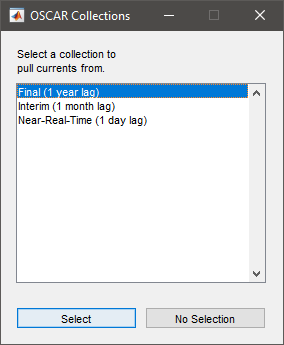

WaveWatch III:
> The WaveWatchIII dataset should download without further input, the new instance of `MATLAB` should provide information on how far along the download is and how long the rest of the data should take to download based on the previous file(s) download speed(s).

## Contributing
Please feel free to open an issue with any problems that occur or changes that feel like they would improve the experience of using the tool.

If you'd like to contribute on your own, please fork the repository and use a feature branch.
Pull requests are warmly welcome.

In general, it is best practice to write your code such that `MATLAB` does not produce warnings or errors.
Further, functions should include argument validation and try to utilize `.json` input files whenever possible.

An easy way to contribute is to generate your own API key [here]( https://developer.nrel.gov/signup/) and submit it via an issue ticket.
